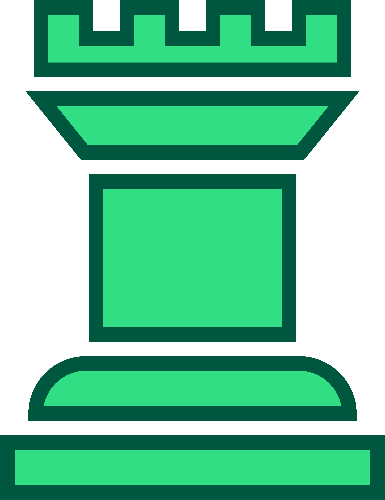

<h1 align="center">

Chess.C

</h1>

## 👩‍💻  The Project

The Project is an Practice project to implement C Programing Language

##  <h2 align="left">🛠 Language and tools used</h2>

  

  

> [!NOTE]
> The Project is not finished yet ! and is being actively worked on by me.

 

  
  
  
  
  

  
  

